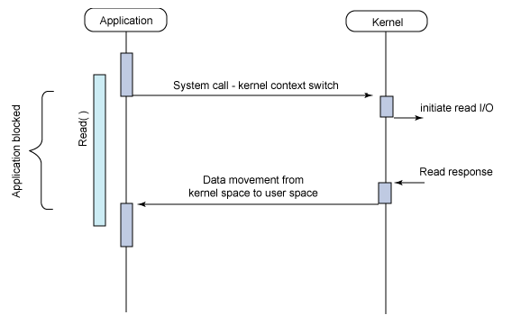
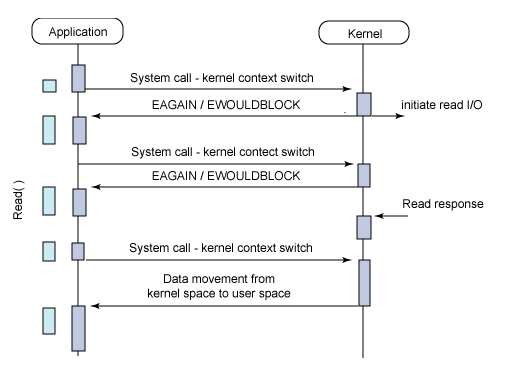

# LINUX SISTEM PROGRAMLAMA

## Sistem Programlamaya Giriş

Ken Thompson işletim sistemini tasarlarken pek çok prensibi MULTICS'den almıştı. 

İlk defa MULTICS'te görülen başlıca özellikler aşağıdaki gibi sıralanabilir:

- Dosya Sistemi: Dosya ve dizinlerden oluşan ağaç yapısındaki hiyerarşi geliştirilmiştir. Sembolik link desteği gibi özelliklere de yer verilmiştir.
- Per-Process Stack: Çekirdek seviyesinde her process için ayrı bir stack alanı kullanılmıştır.
- Komut İşleyici - Kabuk: İlk defa komut işleyici (command processor) kullanıcı kipinde çalışan bir uygulama ile yapılmıştır. Bu fikir daha sonra kabuk şekliyle diğer işletim sistemlerinde ortaya çıkmıştır.
- Process Memory: Dosya işlemleri için IO katmanı yerine, dosyaların process'in adres alanı içerisine haritalanması ve dosya işlemlerinin standart bellek operasyonlarıyla yapılması, alt katmandaki işlemlerin ise işletim sistemi çekirdeği tarafından yerine getirilmesi sağlanmıştır. Günümüzdeki POSIX standartlarıyla konuşacak olursak, sistemdeki tüm dosyaların Memory-Mapped IO mmap ile kullanıldığındakine benzer bir uygulama söz konusudur.
- Dinamik Linkleme: Bazı yönleriyle günümüzdeki kullanımdan bile ileride olduğu söylenebilecek dinamik link desteği geliştirilmiştir.
- Çoklu İşlemci: Birden fazla CPU kullanımı desteklenmektedir.
- Hot-Swap: Çalışma zamanında sistemi kapatma ihtiyacı olmaksızın bellek, disk ve CPU eklenip çıkarılabilmektedir.


## Sistem Çağrıları

Kullanıcı kipinde çalışan bir uygulamanın, sistem çağrıları aracılığıyla işletim sistemi çekirdeğinden ihtiyaç duyduğu servisleri alabilmesi sağlanır.

Linux çekirdeğinde X86 mimarisi için yaklaşık 380 civarında sistem çağrısı bulunur.

### Sistem Çağrısı Nasıl Gerçekleşir?

<sub> Konunun devamında aksi belirtilmedikçe verilen örnekler 32 bit Intel mimarisi için geçerlidir. </sub>

Kullanıcı kipindeyken herhangi bir sistem çağrısı yapıldığında INT `0x80` makine dili kodu ile trap oluşturulur.

Aynı zamanda talep edilen sistem çağrısının numarası, `EAX` yazmacına yazılır.

32 bitlik Intel platformu için Linux çekirdek versiyonu 2.3.31 ve sonrası, maksimum 6 sistem çağrısı parametresini desteklemektedir. Bu parametreler sırasıyla `EBX`, `ECX`, `EDX`, `ESI`, `EDI` ve `EBP` yazmaçlarında saklanır.


### Mimari Bağımlılığı

Sistem çağrılarının doğrudan işlemci mimarisine bağımlıdir.

Örnek olarak Intel 32 bitlik işlemcilerde INT `0x80` ile trap oluşturulurken, ARM mimarisinde aynı işlem supervisor call `SVC` ile yapılır.

Benzer şekilde Intel mimarisinde yapılan sistem çağrısının numarası için `EAX` yazmacı kullanılırken, ARM mimarisinde `R8` yazmacı kullanılır. ARM mimarisinde sistem çağrısına ait 4 adede kadar parametre, `R9`, `R10`, `R11` ve `R12` yazmaçlarına aktarılır. 4 adetten fazla parametre geçilmesi gerektiğinde, bellek üzerinde veri yapısı hazırlanarak bu bölümün adresi geçirilir.


### Sistem Çağrısı Nasıl Yapılır?

Sistem çağrıları, `glibc` kütüphanesindeki *wrapper* fonksiyonlar üzerinden kullanılır.

`glibc` kütüphanesi, üzerinde çalıştığı çekirdek versiyonuna göre, hangi Linux sistem çağrısını yapacağını belirler.

> Bazı durumlarda ise bundan daha fazlasını yaparak, üzerinde çalışılan çekirdek versiyonunda hiç desteklenmeyen bir özelliği de sunuyor olabilir. Örnek olarak, Linux 2.6 versiyonuyla birlikte gelen POSIX Timer API'nin olmadığı Linux 2.4 versiyonu üzerinde çalışan ve aynı anda pek çok timer kullanan bir uygulamanız var ise, glibc çekirdek tarafından alamadığı desteği kullanıcı kipinde her timer için bir thread açarak sağlar. Elbette timer sayınız fazla ise bu çok yavaş bir çözüm olur ancak uygulamanın çalışmasını da mümkün kılar.


### Sistem Çağrıları → Glibc Fonksiyonları İlişkisi

Pek çok sistem çağrısı, aynı isimdeki `glibc` *wrapper* fonksiyonları üzerinden çağrılmaktadır.

Örnek olarak sistem çağrılarını takip etmede sık kullanacağımız strace aracı ile basit bir kodun sistem cagrilarini takip edelim:

```c
  printf("sa");
```

main icinde yazilmis ve gerekli kutuphaneler eklenmis sekilde bu kodu `strace ./deneme` olarak calistirdigimizda cikan ciktidaki karsilik soyledir:

```
[beyza@fedora oba]$ strace ./deneme
[REDACTED]
write(1, "sa", 2sa)                       = 2
[REDACTED]
+++ exited with 0 +++
```
Burada kastedilen glibc içerisindeki `write()` fonksiyonu değil, `write` sistem çağrısıdır.

Strace üzerinden sistem çağrısına geçirilen argümanları ve geri dönüş değerini (2) görmekteyiz.

> Normalde bu yöntemle sistem çağrılarının ismi değil numarası izlenebilir. Strace uygulaması elde ettiği sistem çağrısı numarasını kendi veritabanında arayıp bizler için daha okunabilir bir formda gösterir.


### Performans

Sistem çağrıları normal fonksiyon çağrılarına oranla oldukça yüksek maliyetli işlemlerdir.

Her sistem çağrısında uygulamanın o anki durumunun saklanması, çekirdeğin işlemcinin kontrolünü ele alması ve ilgili sistem çağrısı ile çekirdek kipinde talep edilen işlemleri gerçekleştirmesi, sonra ilgili uygulamanın tekrar çalışma sırası geldiğinde, uygulamanın saklanan durumunun yeniden üretilip işlemlerin kaldığı yerden devamının sağlanması gereklidir.


Özellikle x86 tabanlı mimarilerde `SYSENTER` özel yolu sayesinde sistem çağrılarının hızlanmasını sağladık. Ancak bu yeterli olacak mıdır?

Bir çok uygulamada, özellikle `gettimeofday()` gibi sistem çağrılarının çok sık kullanıldığını görürürüz.

Uygulamalarınızı `strace` ile incelediğinizde, bilginiz dahilinde olmayan pek çok farklı `gettimeofday()` çağrısını yapıldığını görebilirsiniz.

`glibc` kütüphanesinden kullandığınız bazı fonksiyonlar, internal olarak bu fonksiyonaliteyi kullanıyor olabilir.

Java Virtual Machine gibi bir VM üzerinde çalışan uygulamalar için de benzer bir durum söz konusudur.

Görece basit bir işlem olmasına rağmen sık kullanılan bu operasyon yüzünden sistemlerde nasıl bir sistem çağrısı yükü oluşmaktadır? sorusunu kendimize sorabiliriz.


### Linux Dynamic Linker/Loader: ld.so

Paylaşımlı kütüphaneler kullanan uygulamaların çalıştırılması sırasında, Linux Loader tarafından gereken kütüphaneler yüklenerek uygulamanın çalışacağı ortam hazırlanır. En basit Hello World uygulamamız bile `libc` kütüphanesine bağımlı olacaktır.

`ldd` ile uygulamanın linklenmiş olduğu kütüphanelerin listesini alabiliriz:

```
[beyza@fedora oba]$ ldd deneme
	linux-vdso.so.1 (0x00007fffd0ba0000)
	libc.so.6 => /lib64/libc.so.6 (0x00007f0c6f800000)
	/lib64/ld-linux-x86-64.so.2 (0x00007f0c6fa7a000)
```

`Görüldüğü üzere `libc` ve `ld.so` bağımlılıkları listelendi. Fakat `linux-vdso.so.1` kütüphanesi nedir?`

### Virtual DSO: linux-vdso.so.1

linux-vdso.so.1 sanal bir Dnamically Linked Shared Object dosyasıdır. Gerçekte böyle bir kütüphane dosya sistemi üzerinde yer almaz. Linux çekirdeği, çok sık kullanılan bazı sistem çağrılarını, bu şekilde bir hile kullanarak kullanıcı kipinde daha hızlı gerçekleştirmektedir.

Örnek olarak, sistem saati her değişiminde sonucu tüm çalışan uygulamaların adres haritalarına da eklenmiş olan özel bir bellek alanına koyarsa, `gettimeofday()` işlemi gerçekte bir sistem çağrısına yol açmadan kullanıcı kipinde tamamlanabilir.


## API ve ABI

Yazılım geliştiriciler açısından uygulamaların tüm Linux dağıtımlarında ve desteklenen tüm mimarilerde çalışması temel hedeflerden biridir. İdeal durumda, geliştirilen yazılımın belirli bir dağıtım veya mimariye bağımlı olmayıp, taşınabilir olması beklenir.

Sistem seviyesinden bakıldığında taşınabilirlikle ilgili 2 farklı tanım bulunur. Bunlardan ilki *Application Programming Interface* (API) diğeri ise *Application Binary Interface* (ABI) şeklindedir.

### API

API, uygulamaların kaynak kod seviyesinde birbirleriyle iletişim kurabilmelerine imkan sağlayan, önceden anlaşılmış arayüzler olarak tanımlanabilir.

Genellikle her bir API, daha karmaşık ve alt seviye detaylar içeren bir sürecin, çeşitli arayüzlerle (fonksiyon çağrıları vb.) soyutlanması sağlar.

Bu şekildeki bir soyutlama üzerinden kullanılan API'yi sağlayan yazılım bileşenleri güncellense ve alt tarafta yapılan işlemlerle ilgili yöntemler değiştirilse dahi, API seviyesinde aynı arayüz sağlandığı müddetçe diğer uygulamalar için kaynak kod seviyesinde bir değişiklik yapılmasına gerek olmayacaktır.


### ABI

API kaynak kod seviyesinde bir arayüz tanımlarken ABI yazılım bileşenleri arasında belirli bir mimari için obje kod (binary) arayüzlerini tanımlamaktadır.

ABI uygulama bileşenleri arasında binary compatibility'yi sağlar. Bu uyum korunduğu müddetçe aralarında etkileşim bulunan yazılım bileşenlerinin versiyonları değişse de yeniden derlenmeye ihtiyaç duymaksızın eskisi gibi çalışmaya devam ederler.

Fonksiyonların nasıl çağrılacağı, parametrelerin nasıl geçirileceği, yazmaçların kullanım şekilleri, sistem çağrılarının gerçekleştirilme biçimi, uygulamların linklenmesi, binary obje dosya formatı gibi konular ABI içerisinde incelenir. Tüm mimariler için ortak bir ABI oluşturmak mümkün değildir (Java Virtual Machine gibi çözümler ayrı bir başlıkta değerlendirilebilir).

Yazılım geliştirme sürecinde ABI varlığını pek hissettirmez. Kullanılan toolchain içerisindeki araçlar (derleyici, linker vb.) hedef platform için uygun ABI ile kod üretirler.


## Dosya Sistemi

Genel olarak UNIX tabanlı sistemler için şöyle bir özdeyiş vardır: *UNIX sistemlerinde her şey birer dosyadır; eğer bir şey dosya değilse o zaman process'dir.*

Bu yaklaşım Linux için de geçerlidir. Bazı dosyaların diğerlerinden daha özel anlamlarının da olabilmesiyle birlikte (aygıt dosyaları, domain soketler, pipe, link vb.), pek çok işlem dosya sistematiği içerisinde kalınarak gerçekleşmektedir.

### Aygıt Dosyaları

Unix sistemlerde fiziksel aygıtlara erişmek için aygıt dosyaları (device files) kullanılır. Aygıt dosyaları sayesinde çekirdek içerisinde hangi aygıt sürücüsünün kullanılacağı belirlenmiş olur.

Bu yöntemle disk, seri port gibi fiziksel aygıtlara erişilebildiği gibi, /dev/random gibi fiziksel bir karşılığı olmayan, sanal aygıt dosyaları üzerinden erişimler de mümkündür.

`/dev` dizini altındaki aygıt dosyalarının isminin ne olduğunun hiç bir önemi bulunmamaktadır.

```
$ ls -l /dev/sda
brw-rw---- 1 root disk 8, 0 Mar  7 21:52 /dev/sda
```

Yukarıdaki çıktıda normal bir dosyadan farklı olarak 3 farklı bilgi daha yer almaktadır. Bunlar:

- Satırın ilk karakteri olan b, blok tabanlı bir aygıt dosyası olduğunu gösterir. Karakter tabanlı aygıt dosyaları için c kullanılır.
- İlgili aygıta ait Major numarası olarak 8 rakamı görünmektedir.
- İlgili aygıta ait Minor numarası olarak 0 rakamı görünmektedir.


Özetle aygıt dosyaları üzerindeki bu ek bilgilerle, dosyanın karakter tabanlı mı yoksa blok tabanlı erişim gerektirdiği, çekirdek içerisinde kullanılacak Major ve Minor numaralarının neler olduğu bilgisi saklanır.


## Kullanıcı, Grup ve Erişim Yetkileri

Linux, çok kullanıcılı bir işletim sistemidir. Çalışan her uygulama mutlaka bir kullanıcı ve grup no ile ilişkilidir; kullanıcı veya grubu olmayan bir uygulamanın olması söz konusu değildir. Uygulama içerisinden yapılan tüm erişimler, bu kullanıcı ve grup hakları doğrultusunda gerçekleştirilir.

|yetki |  aciklama|
|------|-----------|
|r     |     okuma|
|w     |     yazma|
|x     |calistirma|

### SUID (Set User ID) Yetkisi

SUID yetkisi dosyanın sahibiyle ilgili erişim yetkileri arasında yer alıp, SUID biti üzerinden kontrol edilir.

Bir uygulamada SUID biti aktif ise, o uygulamayı hangi kullanıcı çalıştırırsa çalıştırsın, uygulama dosyasının sahibi kim ise, onun haklarıyla çalışır.

En tipik örnek passwd komutudur.

### SGID (Set Group ID) Yetkisi

SUID biti ile benzer mantıkta, bir uygulamanın, kimin çalıştırdığına bakılmaksızın uygulama dosyasının grup sahibinin grup erişim yetkileri doğrultusunda çalıştırılmasını sağlamaktadır. SGID biti, SUID bitine oranla pratikte daha az kullanım alanı bulmaktadır.

### Sticky Bit

Bir dizin üzerinde sticky bit aktif ise, o dizin altında her kullanıcı yeni dosya oluşturabilir ve kendi oluşturduğu dosyaları silebilir. Diğer kullanıcıların oluşturduğu dosyaları ise silemez.

Ornek: `/tmp`

### Erişim Yetkilerinin Görüntülenmesi

```
$ ls -l /etc/debian_version 
-rw-r--r-- 1 root root 11 May  5  2013 /etc/debian_version
```

```
$ ls -ld /etc/init.d
drwxr-xr-x 2 root root 4096 Feb  2 22:36 /etc/init.d
```

|Karakter       |Anlam
----------------|-----------
|-          	|standart dosya (regular file)
|d 		|dizin
|c 		|karakter tabanlı aygıt dosyası (/dev/console vb.)
|b 		|blok tabanlı aygıt dosyası (/dev/sda3 vb.)
|s 		|özel dosya (unix domain soket vb.)


### Erişim Yetkilerinin Düzenlenmesi

|Karakter       |Etkilediği Grup
----------------|-----------
|u          	|Dosya/dizin sahibi
|g 		|Dosya/dizin grup sahibi
|o 		|Dosya/dizin sahibi ve grup sahibi dışında kalanlar (others)
|a 		|Dosya/dizin sahibi, grup sahibi ve bunların dışında kalanlar dahil her üç blok


### `chmod` Erişim Yetki Parametreleri


|Karakter       |Anlam
----------------|-----------
|r          	|Okuma
|w 		|Yazma
|x 		|Çalıştırma
|X 		|Sadece dizinler için çalıştırma yetkisi
|s 		|Çalışma zamanında user id veya grup id değişimi (suid bit)
|S          	|Suid biti aktif fakat çalıştırma yetkisi yok
|t 		|Sticky bit
|u 		|Dosyanın kullanıcı (user) olarak sahibinin yetkileri
|g 		|Dosyanın grup sahibi yetkileri
|o 		|Dosya ile ilgili diğer (other) kullanıcıların yetkileri


## Dosya İşlemleri

Unix tabanlı sistemlerde genel olarak, bir şey okunabiliyor veya yazılabiliyorsa, dosya arayüzü üzerinden de kullanılabilir. Örnek olarak ağ iletişiminde kullanılan soketler, seri port, dizinler, pipe, timer, sinyal vb. pek çok bileşen üzerinde dosya arayüzü ile işlem yapmak mümkündür.

Dosya arayüzünü açmak için öncelikle ilgili dosyayı açmak ve dosya betimleyiciyi file descriptor elde etmek gereklidir.

File descriptor elde etme yolları kullanılan sisteme göre değişir. Örneğin standart bir dosya için `open()` sistem çağrısı kullanılırken soket açmak istiyorsak `socket()`, timer oluşturmak istiyorsak `timerfd_create()` gibi ilgili sisteme özgü özel bir sistem çağrısı kullanılır.


### Proses Dosya Tablosu

İşletim sistemindeki proses tablosunda, her proses ile ilgili açık dosyaların listesi tutulur. Bu liste yapısı içerisinde açık dosyalarla ilgili ek bir takım bilgiler de saklanır (örneğin normal bir dosya ise inode numarası, erişim yetkileri, son erişim zamanı, geçerli file position vb.)

Çekirdek içerisinde yer alan bu proses tablosunun daha basit bir haline /proc dosya sistemi üzerinden erişmek de mümkündür. Her bir proses id (PID) için aşağıdaki bilgilerin alınması mümkündür:


### /proc/PID/fd

İlgili PID için açık dosyaların `int` descriptor numaralarını içeren sembolink linkler bulunur. Bu sembolink linklerin bulunduğu dizine `ls -l` komutuyla bakılacak olursa veya uygulamanızda `readlink()` fonksiyonuyla sembolik linkin işaret ettiği yerle ilgili bilgileri okumaya çalıştığınızda `type:[inode]` formatında bir yanıt gelir. 

Dosya sistemi üzerinde fiziksel bir inode olmadığı senaryolar için de inode sistematiği içinde kalınarak özgün bir numara verilir.

Örnek olarak açık soket bağlantıları için `readlink()` sonrasında `socket:[205846]` şeklinde bir yanıt döner. Burada tip olarak **soket** bağlantısını olduğunu görmekteyiz, inode bilgisi olarak da **205846** numarası dönülmüştür. Bu numaranın soketler için anlamlandırılması `/proc/net` altındaki ilgili dosyaların okunmasıyla yapılır. Eğer bu soket bağlantısı bir TCP soketine aitse, `/proc/net/tcp` dosyasında, UDP soketine aitse `/proc/net/udp` dosyasında vb. burada görülen inode numarasıyla eşleşecek şekilde kayıtlar bulunduğu görülecektir.

Eğer inode konseptiyle henüz ilişkilendirilemeyen `epoll_create()`, `inotify_init()`, `signalfd()` gibi bir fonksiyonla elde edilmiş file descriptor söz konusu ise bu durumda `anon_inode:<file type>` formatında bir çıktı verecektir.


### /proc/PID/fdinfo

Linux 2.6.22 versiyonu ve sonrasında bu dizin yapısı üzerinden ek bilgiler elde edilmesi mümkündür. Dizin içerisinde her bir `int` file descriptor ile aynı isimde dosyalar bulunur. Herhangi bir dosyanın içerisinde baktığımızda aşağıdaki bilgiler elde edilir:

```
pos:    0
flags:  02
mnt_id: 7
```

Bu dosyada file pointer pozisyonu, dosya açılırken kullanılan `flag`'ler, dosyanın ilişkili olduğu *mount point* referansı yer almaktadır.


### Açık Dosya Limitleri

Unix tabanlı sistemlerde, bir prosesin aynı anda açabileceği dosya sayısının bir limiti bulunmaktadır.

Bu limitler **soft limit** ve **hard limit** adında 2 başlıkta toplanır. Açık dosya limitini `ulimit` uygulamasıyla veya `setrlimit()` fonksiyonuyla artırmak mümkündür. Ancak bu değer hard limit'i aşamaz. Bu limit ancak root kullanıcısı tarafından değiştirilebilir.

```
$ ulimit -a
core file size          (blocks, -c) 0
data seg size           (kbytes, -d) unlimited
scheduling priority             (-e) 0
file size               (blocks, -f) unlimited
pending signals                 (-i) 15234
max locked memory       (kbytes, -l) 64
max memory size         (kbytes, -m) unlimited
open files                      (-n) 1024
pipe size            (512 bytes, -p) 8
POSIX message queues     (bytes, -q) 819200
real-time priority              (-r) 0
stack size              (kbytes, -s) 8192
cpu time               (seconds, -t) unlimited
max user processes              (-u) 15234
virtual memory          (kbytes, -v) unlimited
file locks                      (-x) unlimited

$ ulimit -n 2048
$ ulimit -n
2048
```

Aşağıdaki örnek uygulama ile parametre vererek aynı anda kaç dosya açabileceğini test edebilir, `ulimit -n` komutuyla limitleri değiştirip tekrar testi gerçekleştirebilirsiniz.

```c
#include <stdio.h>
#include <unistd.h>
#include <sys/types.h>
#include <sys/stat.h>
#include <fcntl.h>
#include <stdlib.h>
#include "../common/debug.h"

int main (int argc, char *argv[])
{
    int opened = 0;
    int wanted;
    int i;

    if (argc != 2) {
        printf("Usage: %s NumberOfFiles\n", argv[0]);
        exit(1);
    }

    wanted = atoi(argv[1]);
    for (i = 0; i < wanted; i++) {
        if (open("/dev/zero", O_RDONLY) < 0) {
            errorf("Couldn't open file");
            break;
        }
        opened++;
    }
    debugf("Total of %d files opened", opened);

    return 0;
}
```


Proses başına ayarlanan bu limitin haricinde, sistem genelinde maksimum açık dosya sayısının da bir limiti mevcuttur. Bu değer `/proc/sys/fs/file-max` dosyasından veya `fs.file-max `parametresi ile sysctl üzerinden okunabilir ve değiştirilebilir:

```
$ cat /proc/sys/fs/file-max
389794
$ sudo sysctl fs.file-max=400000
fs.file-max = 400000
$ cat /proc/sys/fs/file-max 
400000
```

##IO Modelleri


|IO Modeli      	|Blocking  		| Non-Blocking
------------------------|-----------------------|---------------
|senkron          	|Read/Write		| Read/Write (O_NONBLOCK)
|asenkron 		|Multiplex IO (select/poll)|AIO

Linux platformunda IO işlemlerini ihtiyaç duyulan senaryo doğrultusundan verimli şekilde yapabilmek için IO modellerinin sunduğu imkanların incelenmesi gerekir.

## Senkron IO

### Senkron Blocking

IO işlemlerinde ilk seçeneğimiz senkron - Blocking IO modelidir. Bu modelde bir process IO talebinde bulunduğunda, işlem tamamlanana kadar ilgili process bloklanır. Linux çekirdeği bu durumda IO bekleme sürecinde bloklanan process'den CPU kaynağını geri alarak, uygun başka bir process'e tahsis eder. IO işlemi tamamlana kadar IO Wait durumunda bloklanan process'e bir daha asla CPU kaynağı tahsis edilmez. Böylelikle IO beklemelerinin sistemin geri kalanına etkisi minimum olur.



Tipik bir örnek verecek olursak, bir process read() fonksiyonuyla sistemden veri talebinde bulunduğunda ilgili sistem çağrısıyla kullanıcı kipinden kernel kipine context switch gerçekleştirilir ve sistem çağrısı tamamlanana kadar bloklanır. Çağrı tamamlandığında (okunan veri kullanıcı kipinde erişilebilecek bir tampona kopyalandığında veya herhangi bir hata oluştuğunda) ilgili process çalışmaya kaldığı yerden devam eder.

Bu geleneksel modelde her tür IO işlemi uygulamayı blokladığından, aynı anda uygulamada farklı işlemlerin yapılması gerekiyorsa thread kullanımı gerekecektir. Örnek olarak aynı anda 2 seri portu ve 20 farklı TCP soketini dinleyen bir uygulama yapmak istiyorsak, sadece IO işlemleri için toplamda 22 farklı thread kullanmamız gerekecektir. Aksi takdirde herhangi birinde IO nedeniyle karşılaşacağımız bloklanma nedeniyle, diğerlerinde veri gelmiş olsa dahi verinin işlenememesine, dolayısıyla uygulamanın toplamda olması gerekenden yavaş ve verimsiz çalışmasına yol açacaktır.

### Senkron Non-Blocking

Senkron IO işleminin diğer bir varyasyonu, Non/Blocking IO modelidir.

Bu modelde IO işlemi yapılacak aygıt `O_NONBLOCK` bayrağı ile Non/Blocking modda açılır. IO kaynağı bu durumda iken herhangi bir `read()` işlemi yapıldığında bloklanmak yerine, verinin varsa hazır olan kısmı kernel kipininden kullanıcı kipindeki tampon alanına kopyalanır, veri henüz hazır değilse `EWOULDBLOCK` hatası döner, sistem çağrısı başka bir sinyal vb. yüzünden kesintiye uğramışsa da standart EAGAIN hatası ile döner. Böylelikle her halikarda bloklanmaksızın `read()` işlemi gerçeklenmiş olur.




Non/Blocking IO modelinde ihtiyaç duyduğumuz veriye tek seferde ulaşamayız. Bloklanmıyor olmanın negatif yönü, parça parça elde edeceğimiz verileri bir döngü ile tamamlanana kadar okumak zorunda oluşumuzdur. Bu aynı zamanda kod karmaşıklığını da artıracaktır. Ancak bloklanılmadığı için, verinin tamamını okumak amacıyla kurulan döngüde sadece okuma işlemi değil, diğer başka kontrol ve işlemlerin de yapılması mümkün olacaktır.

Benzer bir süreç yazma `write()` fonksiyonları için de geçerlidir.

Bu modelin asıl dezavantajı kod karmaşıklığını artırmasından ziyade, daha fazla sistem çağrısı gerektiriyor olmasıdır. Aynı işlem bloklanan bir modelde olsa idi tek bir sistem çağrısı ile yapılabilecekken, Non/Blocking IO modelinde bir döngü içerisinde tamamlana kadar, belirsiz sayıda sistem çağrısı yapılmak zorunda kalınmaktadır. Sistem çağrılarının genel maliyeti ve kullanıcı kipi -> kernel kipi context switch'lerinin sürekli yapılıyor olması sistem performansını önemli ölçüde düşürecektir.

Non/Blocking IO modu standart dosyalar üzerinde pek fazla anlam taşımaz. Asıl olarak soket işlemleri, FIFO ve pipe kullanımı, terminal, seri port vb. gibi aygıtlardan okuma ve yazmalarda kullanımı anlamlıdır.

Standart bir dosyayı Non/Blocking modda `O_NONBLOCK` bayrağı ile açsanız dahi, gerçekte değişen hiç bir şey olmaz. Linux tüm bu tarz dosya işlemlerini tampon kullanarak buffered biçimde gerçekleştirir. Herhangi bir yazma işlemi yapıldığında kullanıcı kipinden alınan veri doğrudan depolama birimine yazılmak yerine, kernel tarafından tutulan page cache tablolarına yazılır. Bu şekilde write çağrıları çok daha hızlı dönecektir. Ancak page cache tablolarında yer kalmadığında, yenilerini açmak için yapılan işlemler nedeniyle `write()` çağrıları uygulamayı bloklar (standart bir dosya Non/Blocking modda açılmış olsa dahi)

Benzer şekilde standart bir dosya bu modda okunmaya çalışıldığında kernel tarafından veriler disk üzerinden page cache içerisine alınır ve buradan kullanıcı kipine kopyalanır. Hatta özellikle sıralı erişim yapılan dosyalarda kernel, uygulama henüz talep etmeden, daha önden giderek o anki dosya ofsetinden ileriye doğru okuma yapıp page cache tabloları içerisine veri okumaya devam eder. Bu işlem `read-ahead` modu olarak da adlandırılır. Böylece uygulama katmanında sonradan yapılacak `read()` işlemleri doğrudan page cache içerisinden karşılanabilmektedir. İstenen verinin cache'te olmaması durumunda verinin diskten okunup getirilmesi için gereken süre zarfında `read()` fonksiyonu da bloklanacaktır.

## Sinyaller

Sinyal mekanizması, sistemde yeni bir olay (event) oluştuğunda çalışan uygulamaların asenkron biçimde haberdar edilebilmesine olanak verir.

Sinyaller 3 temel durumda oluşturulur:

- Donanım tarafında istisnai bir durum oluştuğunda sinyal üretilir. Örnek olarak uygulamanın kendi izin verilen adres alanının dışındaki bir bölgeye erişmeye çalışması (Segmentation Fault), sıfıra bölme işlemi içeren bir makine kodu üretilmesi vb. gösterilebilir.
- Kullanıcı tarafından konsolda CTRL-C veya CTRL-Z gibi tuş kombinasyonlarının kullanımı, konsol ekranının yeniden boyutlandırılması ya da kill uygulaması ile sinyal gönderim isteğinin oluşturulması
- Uygulama içerisinde kurulan bir timer'ın dolması, uygulamaya verilen CPU limitinin aşılması, açık bir file descriptor'e veri gelmesi vb.

### Sinyal Numaraları

Sinyaller sistemde 1'den başlamak suretiyle nümerik değerlerle gösterilirler.

Örnek olarak 1 nolu sinyal, hemen her sistemde HUP sinyali olarak değerlendirilirken 9 nolu sinyal de KILL sinyali olarak bilinir.

Linux sistemlerdeki sinyal numaralarını uygulama kodunuzda doğrudan include etmeniz gerekmeyen /usr/include/asm-generic/signal.h dosyasında bulabilirsiniz.


### Sinyal Üretimi ve Gönderimi

Sinyal üretimi, bir olay nedeniyle gerçekleşir. Ancak sinyalin ilgili uygulamaya gönderilmesi (deliver) işlemi, sinyalin üretimi ile aynı anda olmaz.

Sinyalin uygulamaya gönderilebilmesi için uygulamanın o an CPU kaynağına sahip ve Running durumda çalışıyor olması gereklidir. Dolayısıyla belirli bir uygulamaya gönderilmek üzere üretilen bir sinyalin gönderimi, ilgili uygulamanın context-switch sonrası tekrar çalışmaya başlamasıyla birlikte gerçekleşir.


### Bekleyen (Pending) Sinyal Kavramı

Sinyalin üretim anından gönderilme işlemi gerçekleşene kadarki süre zarfında, sinyaller pending olarak işaretlenir ve beklemede tutulur.

Bir process için bekleme durumundaki sinyal sayısı ve izin verilen pending sinyal sayısına, proc dosya sisteminden ilgili process id (PID) dizini altındaki /proc/PID/status dosyasında SigQ: 2/15235 örneğindeki gibi erişilebilir.


### Sinyal Maskeleri ve Bloklama

Sinyallerin asenkron doğası nedeniyle uygulama tarafından ne zaman geleceğinin öngörülemez olması, uygulamada kritik bir işlem yapılıyorken kesintiye uğrama riskini de beraberinde getirir.

Bu şekildeki istenmeyen durumların önüne geçebilmek için sinyal maskeleri kullanarak kritik bir işlem öncesi bazı sinyalleri bloklama, kritik olan kısım tamamlandıktan sonra da tanımlanmış blokları kaldırma imkanı sağlanmıştır. Bu işlem uygulama geliştiricinin sorumluluğundadır.

Uygulama tarafından bir sinyal bloklandığında, blok kaldırılana kadar üretilen aynı tipteki diğer sinyaller bekleme (pending) durumunu korur. Uygulamada blok kaldırıldığın anda bekleyen sinyallerin gönderimi de sağlanır.

Bu şekilde blok anında beklemeye geçen sinyallerden aynı tipte olanlar, normal kullanımda blok kaldırıldıktan sonra uygulamaya sadece 1 defa gönderilir. Realtime sinyallerde ise durum farklıdır.


Sinyal Türleri

Sinyal türlerine göre öntanımlı eylemler değişkenlik gösterebilmektedir. Eğer uygulama içerisinde ilgili sinyali karşılayan bir signal handler fonksiyonu tanımlanmamış ise, öntanımlı eylem gerçekleşecektir. Bu bazen uygulamanın sonlandırılması bazen de sinyalin gözardı edilmesi anlamına gelir.

Bazı sinyallerin ise uygulama katmanında yakalanması mümkün değildir, bu tarz sinyaller her zaman öntanımlı eylemi gerçekleştirirler (KILL sinyali gibi).

Uygulamanın sonlanmasına yol açan bazı eylemlerde ek olarak core dump dosyası da üretilir. Core dump dosyaları, ilgili process'in sanal bellek tablosunun diske yazılması suretiyle, sonraki aşamalarda debug araçları ile process'in sonlanmadan önceki durum bilgisinin incelenebilmesi amacıyla oluşturulur.


|Sinyal 	|No 	|Öntanımlı Eylem 	|Yakalanabilir mi?
|---------------|-------|-----------------------|-----------------
|SIGHUP 	|1 	|Uygulamayı sonlandır 	|Evet
|SIGINT 	|2 	|Uygulamayı sonlandır 	|Evet
|SIGQUIT 	|3 	|Uygulamayı sonlandır (core dump) 	|Evet
|SIGILL 	|4 	|Uygulamayı sonlandır (core dump) 	|Evet
|SIGTRAP 	|5 	|Uygulamayı sonlandır (core dump) 	|Evet
|SIGABRT 	|6 	|Uygulamayı sonlandır (core dump) 	|Evet
|SIGFPE 	|8 	|Uygulamayı sonlandır (core dump) 	|Evet
|SIGKILL 	|9 	|Uygulamayı sonlandır 	|Hayır
|SIGBUS 	|10 	|Uygulamayı sonlandır (core dump) 	|Evet
|SIGSEGV 	|11 	|Uygulamayı sonlandır (core dump) 	|Evet
|SIGSYS 	|12 	|Uygulamayı sonlandır (core dump) 	|Evet
|SIGPIPE 	|13 	|Uygulamayı sonlandır 	|Evet
|SIGALRM 	|14 	|Uygulamayı sonlandır 	|Evet
|SIGTERM 	|15 	|Uygulamayı sonlandır 	|Evet
|SIGUSR1 	|16 	|Uygulamayı sonlandır 	|Evet
|SIGUSR2 	|17 	|Uygulamayı sonlandır 	|Evet
|SIGCHLD 	|18 	|Yoksay 	|Evet
|SIGTSTP 	|20 	|Durdur 	|Evet
|SIGURG 	|21 	|Yoksay 	|Evet
|SIGPOLL 	|22 	|Uygulamayı sonlandır 	|Evet
|SIGSTOP 	|23 	|Durdur 	|Hayır
|SIGCONT 	|25 	|Durdurulmuşsa sürdür 	|Evet
|SIGTTIN 	|26 	|Durdur 	|Evet
|SIGTTOU 	|27 	|Durdur 	|Evet
|SIGVTALRM 	|28 	|Uygulamayı sonlandır 	|Evet
|SIGPROF 	|29 	|Uygulamayı sonlandır 	|Evet
|SIGXCPU 	|30 	|Uygulamayı sonlandır (core dump) 	|Evet
|SIGXFSZ 	|31 	|Uygulamayı sonlandır (core dump) 	|Evet


